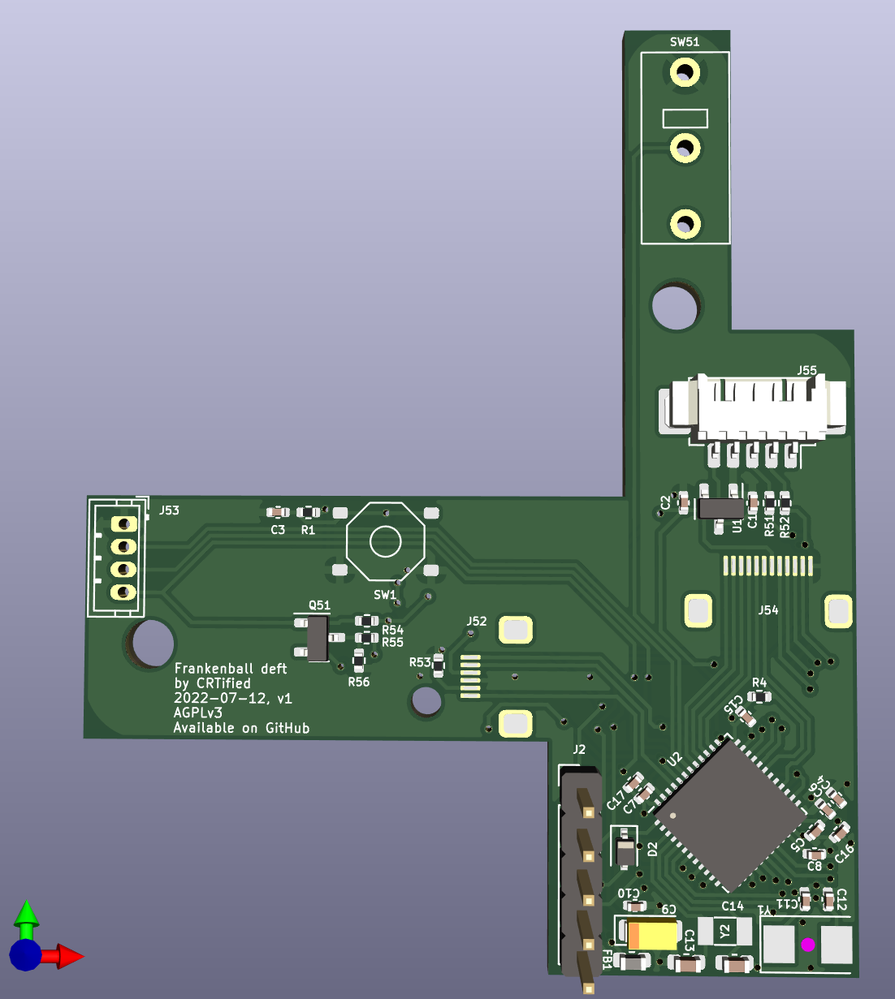

# Frankenball-deft

This project is a replacement PCB for the Elecom Deft (non-pro) trackball.
Besides the basic functionality, it exposes two additional GPIO pins 
(also usable for debugging) and is powered by QMK (TODO) on an STM32F411.

The sensor used in the Elecom deft is an PWM3320.

Some additional soldering is required. 
The PCB is intended for SMT assembly by JLCPCB. 
The only extended part is the STM32F411, every other part is a basic component.

## Additional componens used

 - 0.5mm 6pin Clamshell FFC connector (PWM3320 Sensor)
   - https://aliexpress.com/item/1005003981823532.html
 - 0.5mm 12pin Clamshell FFC connector (Side button daughterboard)
   - https://aliexpress.com/item/1005003981823532.html
 - 4 pin JST ZH header (1.5mm pitch) (M1/M2/M3 daughterboard)
   - https://aliexpress.com/item/32763788431.html
 - 51146 Socket (USB connection)
   - https://aliexpress.com/item/4000818221650.html
 - Microswitch (Right mouse button)
   - https://aliexpress.com/item/4000682779339.html
   - https://aliexpress.com/item/4000555763322.html

## Rendered PCB

